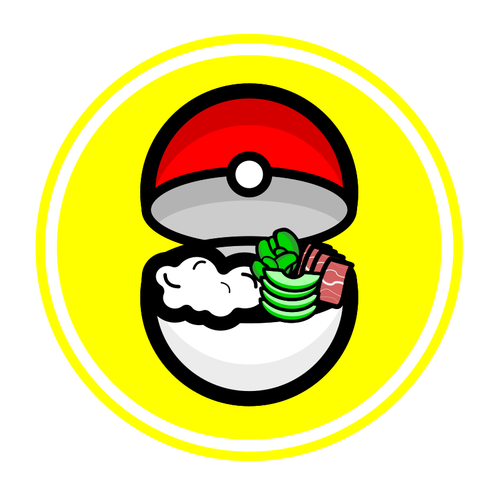

<h1 align="center">
  
  PokebowlDex
</h1>

Aren’t you tired of wondering what your favorite gluttonous Pokémon like to eat? Me too! That’s why PokebowlDex is here to help.

Born out of a love for food and the mons (that’s what the cool kids call them these days... right?), PokebowlDex showcases some of the biggest, hungriest, and most delicious-looking Pokémon out there — along with their favorite dishes.

It’s tailor-made for those Pokémon trainers who have to catch ’em all… but only after dinner.
## Features
- Single-page application using Next.js App Router, Tailwind CSS for styling
- Two screens: Pokédex list view (/) & Detail view (/pokemon/[name])
- Shows Pokémon from the [PokéAPI](https://pokeapi.co/), no API key needed
- Detail view attributes and a custom “favorite dish” field I personally added based on years of field research
- Pagination of items
- Unit tests written with Jest/React Testing Library
- Responsive design
- Passed Lighthouse audit (it's not much but its honest work 👨‍🌾)

## Getting Started

1. Clone the repository then:

   ```bash
   npm install

2. **Start App:**
   ```bash
   npm run dev

## API Key
- What API key? Works out of the box

## Testing
```bash
   npm run test
```

## DEMO


## Lighthouse audit


## With More Time & Snacks...

While the core goals of the project were completed with roughly 12 hours of focused work, here are a few areas I’d explore or refine further with more time:

- **Enhanced Accessibility:**  
  Improve ARIA roles, keyboard focus states, and add screen reader labels to interactive elements.

- **Unit & Integration Test Coverage:**  
  Expand tests to cover edge cases, navigation flows, and possible error states with more detail.

- **UX/UI:**  
  Take a Designer course. Then go to Designer school. Followed by an apprenticeship at Apple. And then maybe have the skill to improve UI
